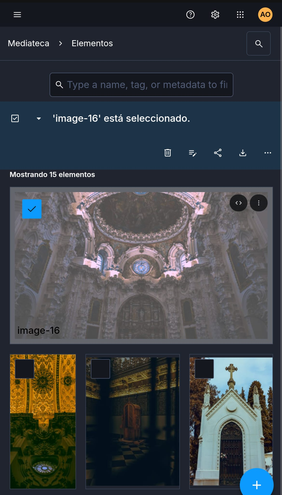
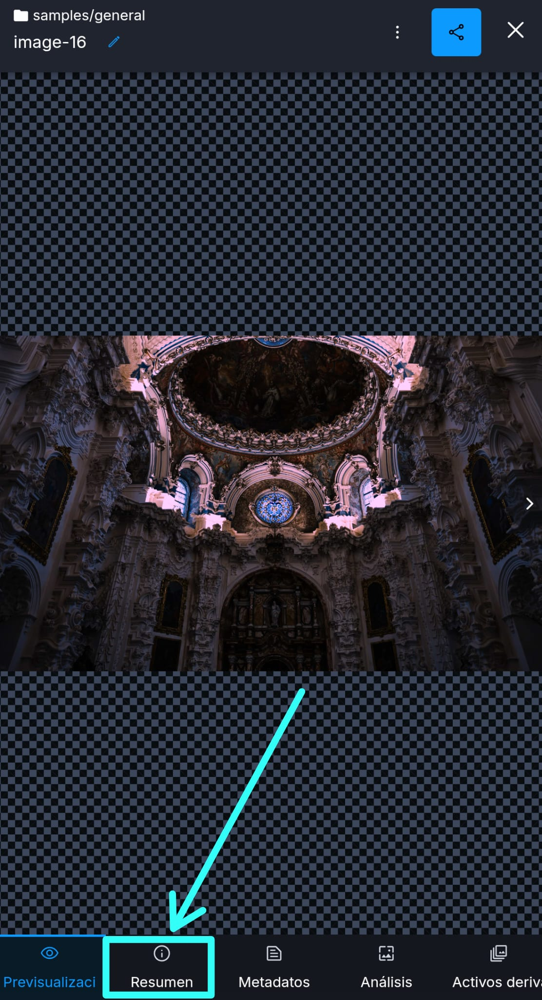
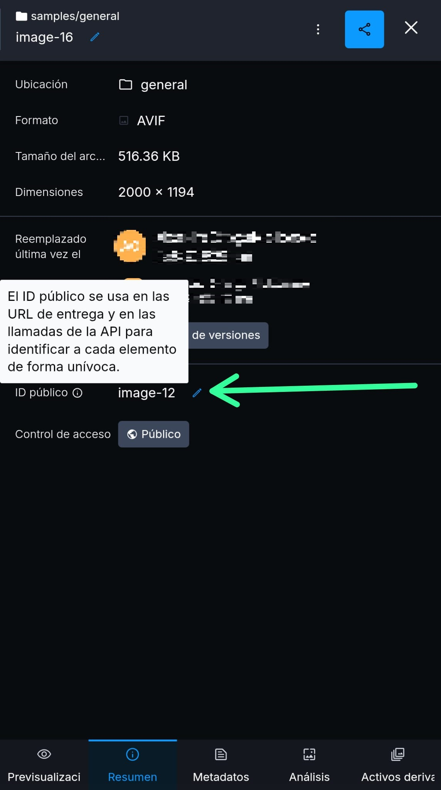

# 📸 Nomad Phokus - Guía de Gestión y Uso del Portfolio Fotográfico (en tanto que nivel de usuario final).

¡Bienvenido al sistema de Portfolio Web - Nomad Phokus! No necesitas saber programar para que tus fotos aparezcan en una web minimalista y sobria. Este documento te explica cómo gestionar tu galería usando solo tu cuenta de **Cloudinary**.

---

## 🚀 Cómo subo mis fotos (Paso a Paso)

Una vez tu 'cloudname' ha sido correctamente establecido en el href del botón que llevará a tu portfolio (se da por hecho por el desarrollador o editor del código) y que la web reconozca tus imágenes y las muestre correctamente, debes seguir estas reglas de nombrado y ubicación:

### 1. Entrar en tu panel
Inicia sesión en tu cuenta de [Cloudinary](https://cloudinary.com/) y dirígete a la **Media Library** (Biblioteca de medios).

### 2. Ubicación de los archivos
Debes navegar hasta la siguiente carpeta:
`sample` > `general`

> **Nota:** Es fundamental que las fotos estén dentro de esa ruta exacta, ya que la web busca los archivos específicamente ahí.

### 3. El secreto: El nombre de los archivos
La web está programada para buscar imágenes con un nombre secuencial. **No uses nombres personalizados** (como "montaña.jpg" o "castillo.png"). 

Renombra tus fotos antes de subirlas siguiendo este patrón:
* `image-1` (Esta será la primera foto que aparezca).
* `image-2`
* `image-3` ... y así sucesivamente.

---

## 🛠️ Preguntas Frecuentes (FAQ)

#### Pero no entiendo, Svån. ¿Entonces en qué formato debo subir las fotos?
Te recomiendo subirlas a Cloudinary en **AVIF** por la relacion calidad eficiencia superior a los demás formatos, pero puedes subirlas también en otros formatos que por orden de prioridad son los siguientes: **AVIF > WEBP > JPG > JPEG > PNG**.

En cuyo caso tomes mi recomendación, exporta desde Lightroom o similar en formato **AVIF** con **calidad 70** (con 60 incluso es suficiente), y con **[x] Redimensionar para encajar** con **borde largo a 2000px** con una resolución de **72 píxeles por pulgada**.

#### ¿Tengo que tocar el código de GitHub?
**No.** Una vez que subas la foto a Cloudinary con el nombre correcto (ej. `image-4`), la web la detectará y la publicará automáticamente en la posición de la celda correspondiente la próxima vez que alguien entre.

#### ¿Hay un límite de fotos?
Sí, está configurado principalmente para buscar hasta **100 imágenes** y detenerse (Está de _súper_ sobra para un portfolio fotográfico en la mayoría de los casos). Igualmente es algo que puede modificarse rápidamente. 

#### He subido una foto pero no aparece, ¿qué hago?
1. Verifica que el nombre sea exactamente `image-número_de_la_foto` (sin espacios).
2. Asegúrate de que no te has saltado ningún número (si tienes `image-1` e `image-3`, pero falta `image-2`, el sistema sólo mostrará la primera).
3. Refresca la página de la web.
4. A veces puede tardar un buen rato en actualizarse dependiendo de factores que, de forma resumida, escapan al alcance del programa web, pero terminarán viéndose reflejados los cambios pertinentes si has seguido el paso a paso.

#### Para cambiar la posición de las fotos que ya he subido, ¿qué tengo que hacer?
1. Entra a [Cloudinary](https://cloudinary.com/) y dirígete a tu **Media Library** (Biblioteca de medios)
2. Seleccionar la foto y darle dos toques/clics dependiendo del dispositivo que uses para Cloudinary.

    

3. Seleccionar "Resumen".

    

4. Cambiar el Public ID al número que quieras cambiar, por ejemplo: cambiar la posición de la foto 75 por la de la foto 12, como no es posible dar el mismo Public ID a dos elementos tendrás que poner uno aleatorio para poder cambiar el otro al Public ID sustituido. Para ver los cambios simplemente borra la caché de tu navegador y al cabo de unos minutos se verán reflejados.

    

---

## 📬 Contacto Técnico
Si el sistema deja de cargar fotos, quieres cambiar la ruta de las carpetas o simplemente buscas adaptar el portfolio a tu estilo, contacta con el administrador del código, (**Svån**), a través de los distintos enlaces de contacto presentes en el perfil.

---
*Mantenlo simple. Enfoca tu pensamiento. Captura el momento.*
